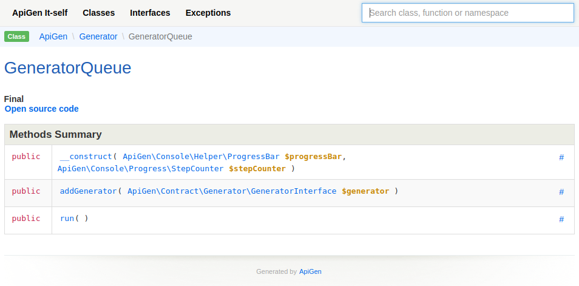

# Smart and Readable Documentation for your PHP project

[](https://travis-ci.org/ApiGen/ApiGen)
[](https://coveralls.io/github/ApiGen/ApiGen?branch=master)
[](https://packagist.org/packages/apigen/apigen/stats)
[](https://packagist.org/packages/apigen/apigen)

ApiGen is the simplest, the easiest to use and the most modern api doc generator. It is **all PHP 7.1 features ready**
easy to extend with own Finder, Annotation Subscriber or even Generator.

Just look at [**ApiGen API**](https://apigen.github.io/ApiGen):



## Your Help is Needed to Finish 5.x Release

:heart: We need your help to test new version of ApiGen.

### How to install it?

Add to your `composer.json`:

```json
{
    "require": {
        "apigen/apigen": "dev-master",
        "roave/better-reflection": "dev-master#1efdfe5"
    }
}
```

then update:

```bash
composer update
```

Test it, report issues or send PRs.

 :skull:  **Version 4.x is not supported**, since there was huge change of Reflection library and the code was almost completely rewritten.


## Built on Shoulders of Giants

- PHP 7.1+
- [nikic/PHP-Parser](https://github.com/nikic/PHP-Parser)
- [Roave/BetterReflection](https://github.com/Roave/BetterReflection)
- [phpDocumentor/TypeResolver](https://github.com/phpDocumentor/TypeResolver)
- [phpDocumentor/ReflectionDocBlock](https://github.com/phpDocumentor/ReflectionDocBlock)


## Install

```bash
composer require apigen/apigen --dev
```


## Usage

Generate API docs by passing single source and destination options:

```bash
vendor/bin/apigen generate src --destination docs
```

Or generate API docs for multiple directories:

```bash
vendor/bin/apigen generate src tests --destination docs
```


## Configuration

Below is a minimal example configuration. Save it as a `apigen.yml` file in
the root of your project:

```yaml
parameters:
    visibility_levels: [public, protected] # array
    annotation_groups: [todo, deprecated] # array
    title: "ApiGen Docs" # string
    base_url: "http://apigen.org/api" # string
    overwrite: false # bool
```


## What Annotations Have Extra Care?

### `@see`, `@covers`, `@uses`

Reference to Class, Function, Property, Method etc. element.

**In Code**

```php
/**
 * @see SomeClass
 * @see SomeClass::$propety
 * @see SomeClass::someFunction()
 */
```

**Generated**

```html
@see <a href="class-SomeClass.html">SomeClass</a>
@see <a href="class-SomeClass.html#$someProperty">SomeClass::$property</a>
@see <a href="class-SomeClass.html#_someFunction">SomeClass::someFunction()</a>
```

---

### `@link`

A website url.

**In Code**

```php
/**
 * This is already mentioned on Wiki.
 * @link https://en.wikipedia.org/wiki/United_we_stand,_divided_we_fall Click to see a cool quote
 */
```

**Generated**

```html
This is already mentioned on Wiki.
@link <a href="https://en.wikipedia.org/wiki/United_we_stand,_divided_we_fall">Click to see a cool quote</a>
```

### `@internal`

Associated element is internal, so ApiGen hides it.


## Themes

To enable a custom theme just provide `theme_directory` configuration option in your `apigen.yml`:

```yaml
parameters:
    theme_directory: path/to/theme # path to theme's config file
```

## Contributing

Rules are simple:

- **new feature needs tests**
- **all tests must pass**
    ```bash
    composer complete-check
    ```
- **1 feature per PR**

We would be happy to merge your feature then.
